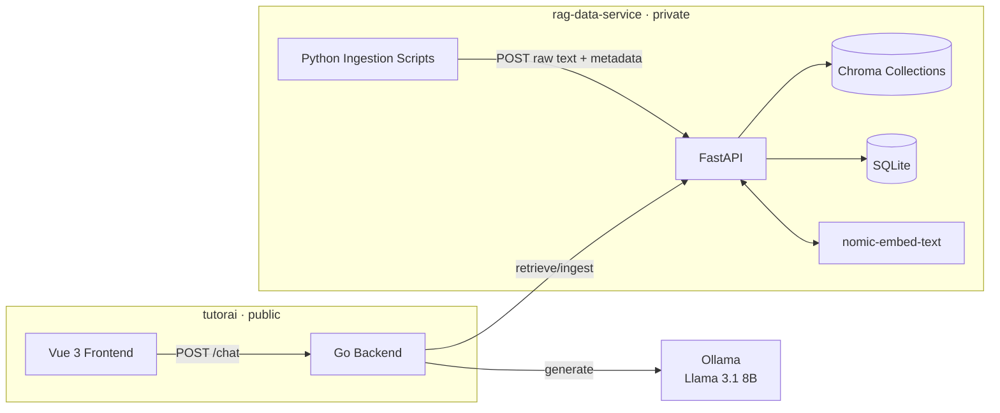

# TutorAI

A RAG-powered Magic: The Gathering assistant built on an open-core architecture. Ask natural language questions about deck building, card rules, and card lookup — answers grounded in real card data and the official Comprehensive Rules.

## Repositories

| Repo | Visibility | What it is |
|---|---|---|
| [`tutorai`](https://github.com/megajess/tutorai) | Public | Vue 3 frontend, Go backend |
| [`rag-data-service`](https://github.com/megajess/rag-data-service) | Private | FastAPI data backend — Chroma vector DBs, SQLite card data, API key auth |

This root repo is the workspace container. It holds no application code — only this README and submodule references to the two repos above.

## System Architecture

## Why two repos?

**Open-core model:** the application code is public, the curated data backend is private.

- **`tutorai` (public)** — the application layer: retrieval pipeline, intent classification, prompt assembly, Ollama LLM integration, Vue frontend. Anyone can clone it and wire it to their own data service instance.

- **`rag-data-service` (private)** — the data layer: Chroma vector DBs holding the embedded MTG card and rules corpora, SQLite for structured card filtering, multi-tenant API key auth. This is the proprietary part. It's also designed from the start to serve future RAG projects as additional namespaces — not just TutorAI.

The RAG patterns and retrieval pipeline in `tutorai` are not a competitive advantage — they're openly documented as a portfolio piece and a learning resource. The curated, cleaned corpus in `rag-data-service` is the real work.

## Running locally

Both services run on the same machine in v1. Full instructions are in each repo's `SETUP.md`.

**Prerequisites:** Go 1.22+, Python 3.11+, Node.js 18+, [Ollama](https://ollama.ai) with `llama3.1` and `nomic-embed-text` pulled.

1. **[Set up rag-data-service](https://github.com/megajess/rag-data-service/blob/main/SETUP.md)** — start the FastAPI service on `:8001`
2. **[Set up tutorai](https://github.com/megajess/tutorai/blob/main/SETUP.md)** — start the Go backend on `:8000`, start the Vue frontend on `:5173`

## Context

This project is a deliberate rehearsal for a larger domain-specific AI chatbot. The architecture — tiered retrieval, intent classification, open-core repo split, custom RAG pipeline without LangChain or LlamaIndex — is designed to port directly. TutorAI is the first tenant of `rag-data-service`; the service is already built for reuse.

Detailed documentation lives in each repo's `docs/` directory. Architectural decisions are recorded in `docs/decisions.md` in each repo.
